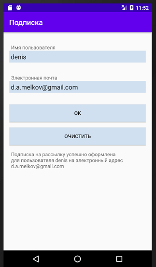

## Задача №1
** Универсальная форма ввода **
В процессе разработки Android-программы в первую очередь мы работаем с пользовательским вводом. Один из типичных вариантов приминения пользовательского ввода это форма регистрации или подписка на рассылку.

### Задание:
Нужно создать приложение, которое будет предлагать пользователю подписаться на рассылку, введя имя пользователя и электронную почту. Таким образом, нужно:
- Установить заголовок окна в "Подписка"
- Создать в разметке экрана форму для ввода имени пользователя и пароля
- Создать Текстовое поле для вывода результата
- Создать кнопку "ОК", при нажатии на которую в текстовое поле будет попадать текст: "Подписка на рассылку успешно оформлена для пользователя <Имя пользователя из поля> на электронный адрес <Email из формы>"
- Создать кнопку "Очистить", которая будет очищать форму (оба поля ввода) и удалять текст из текстового поля с результатом

